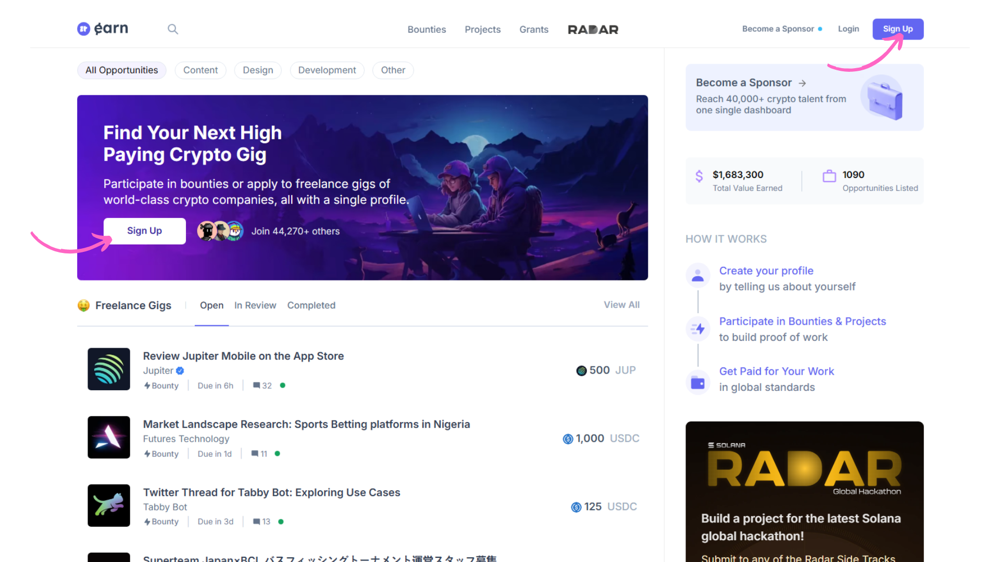
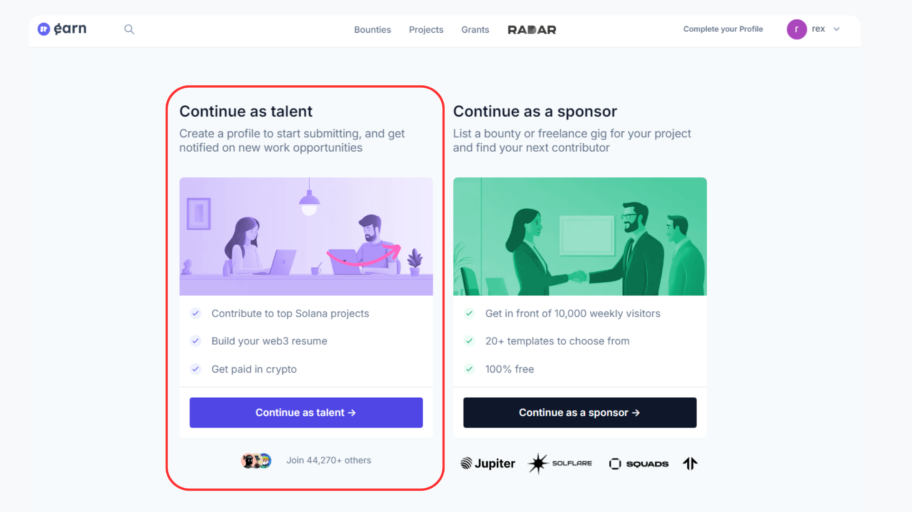

# How to Join Superteam

Create an account

1. **Visit the Superteam website**: Head over to [https://earn.superteam.fun/](https://earn.superteam.fun/) to begin the sign-up process.

<figure><figcaption></figcaption></figure>

**Choose your login method**: You’ll have the option to either sign in with Google or your email. Pick whichever option is more convenient for you.

<figure><figcaption></figcaption></figure>

**Select your role**: After completing registration, you’ll be asked to choose between **"Talent"** or **"Sponsor."**. Since this guide is for talents, select **"Continue as Talent"** to proceed.

<figure><figcaption></figcaption></figure>

**Fill out your profile**: Provide the required information accurately in the form. This includes details about your skills, interests, and expertise.&#x20;

Once submitted, you’re one step closer to joining the Superteam community.

<figure><figcaption></figcaption></figure>

**Finalize your profile**: Once your profile is fully set up, it will look similar to the provided example. You’ll then be ready to explore earning opportunities and contribute to the Solana ecosystem, tapping into bounties, projects, and collaborations available to Superteam members.

<figure><figcaption></figcaption></figure>

Now that you’ve registered, the next step is to actively engage with the Superteam and start by connecting with your local **State Mod**, who will guide you through the community and opportunities.

Click on the next section to learn how to find and interact with your State Mod, and get started on your journey with Superteam!

\
:link: [Suggest changes to this page](how-to-join-superteam.md)
