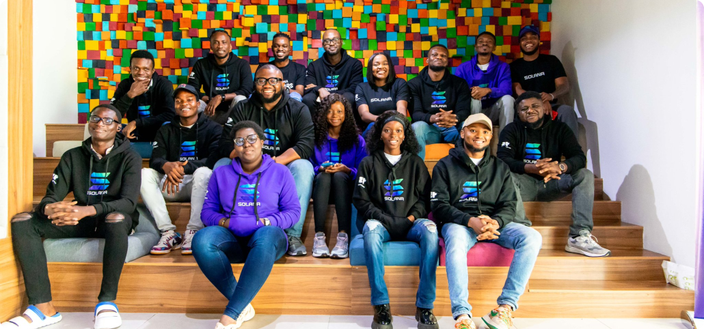

# What is Superteam?

[Superteam](https://x.com/SuperteamNG) is a community of talented individuals who come together to learn, earn, and build in the crypto space. It is a collective of creatives, developers, and business professionals with a track record of launching and scaling tech companies.&#x20;

Whether you're just starting out or have experience, Superteam offers a collaborative environment to develop skills, work on innovative projects, and be part of the rapidly growing blockchain industry.

<figure><figcaption></figcaption></figure>

Superteam's main goal is to support the growth and success of the Solana ecosystem. It achieves this by promoting collaboration, funding innovative projects, and offering mentorship to emerging talents and ventures.

Additionally, Superteam acts as a gateway for individuals interested in joining the web3 space, providing a platform to learn, earn, and develop in this fast-evolving field.

\
:link: [Suggest changes to this page](what-is-superteam.md)
