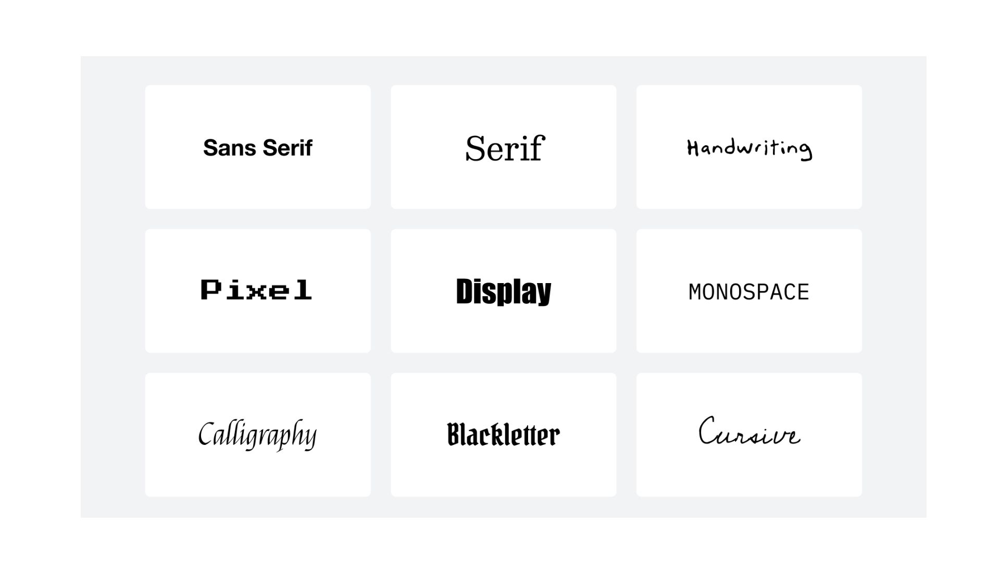

# Essential Design Principles



### **Color Theory & How to Use Colors**

Color theory is the foundation of creating visually appealing designs. It helps designers understand how colors interact, evoke emotions, and influence perception.

<table data-view="cards"><thead><tr><th></th><th data-hidden data-card-cover data-type="files"></th></tr></thead><tbody><tr><td><strong>Primary Colors: Red, Blue, and Yellow:</strong> These are colors that cannot be created by mixing other colors.</td><td><a href="../../.gitbook/assets/image (7).png">image (7).png</a></td></tr><tr><td><strong>Secondary Colors: Green, Orange, Purple:</strong> These colors are created by mixing two primary colors.</td><td><a href="../../.gitbook/assets/image (9).png">image (9).png</a></td></tr><tr><td><strong>Tertiary Colors:</strong>  These colors are created by mixing a primary and a secondary color (e.g., Red-Orange, Blue-Green).</td><td><a href="../../.gitbook/assets/image (11).png">image (11).png</a></td></tr></tbody></table>

### Color Models

<table data-view="cards"><thead><tr><th></th><th data-hidden data-card-cover data-type="files"></th></tr></thead><tbody><tr><td><strong>RGB (Red, Green, Blue):</strong> Used for screens and digital media.</td><td><a href="../../.gitbook/assets/image (12).png">image (12).png</a></td></tr><tr><td><strong>CMYK (Cyan, Magenta, Yellow, Black):</strong>  Used for printing materials.</td><td><a href="../../.gitbook/assets/image (14).png">image (14).png</a></td></tr><tr><td><strong>HSL/HSV (Hue, Saturation, Lightness/Value):</strong> Used in image editing and digital design for color adjustments.</td><td><a href="../../.gitbook/assets/image (15).png">image (15).png</a></td></tr></tbody></table>

### **Color Harmony – Choosing the Right Colors**

<figure><figcaption>
<a href="https://www.google.com/url?sa=i&#x26;url=https%3A%2F%2Fthebass.org%2Flearn%2Flesson-plan-world-of-color%2F&#x26;psig=AOvVaw3Nc-i1Z5trorYMNucIjWmJ&#x26;ust=1740825866242000&#x26;source=images&#x26;cd=vfe&#x26;opi=89978449&#x26;ved=0CBgQ3YkBahcKEwjwh-Dwl-aLAxUAAAAAHQAAAAAQJg">Bass Museum of Art</a>
</figcaption></figure>

* Complementary Colors (Opposites on the color wheel): They are high contrast which is great for making elements stand out. E.g Blue & Orange, Red & Green
* Analogous Colors (Next to each other on the color wheel). Creates a harmonious and soothing look. E.g: Blue, Teal, Green
* Triadic Colors (Evenly spaced on the wheel). Vibrant and dynamic, often used in branding. E.g: Red, Yellow, Blue
* Monochromatic Colors (Shades & tints of one color). Sophisticated and minimalistic. E.g: Light Blue, Medium Blue, Dark Blue

### **Psychological Effects of Colors**

<figure><figcaption>
<a href="https://www.dianealber.com/products/copy-of-a-little-calm-spot-download-activity-printable-1">Diane Alber</a>
</figcaption></figure>

Red – Passion, energy, urgency (e.g., sales, food brands).

Blue – Trust, calmness, professionalism (e.g., corporate, tech).

Yellow – Happiness, warmth, optimism (e.g., kiddies brands).

Green – Nature, growth, health (e.g., organic brands).

Purple – Royalty, creativity, luxury (e.g., beauty, fashion).

Black – Elegance, power, mystery (e.g., high-end brands).

White – Simplicity, cleanliness, purity (e.g., medical, minimalist).

***

## **Typography Basics (Choosing & Pairing Fonts)**

<figure><figcaption></figcaption></figure>

Typography plays a crucial role in design, influencing readability, mood, and brand identity. Before pairing fonts, it's essential to understand the categories:

**Serif:** Fonts with small strokes (serifs) at the ends of letters. E.g. Times New Roman.

**Sans-serif:** Clean, modern fonts without serifs. e.g Helvetica.

**Slab Serif:** Bold, block-like serifs. E.g Rockwell.

**Script:** Handwritten or calligraphic fonts.

**Display:** Decorative and unique fonts for headlines.

When selecting a font, one has to ensure it's clear, matches the message, and can be used across different mediums and sizes.

### **Font Pairing Techniques**

* Contrast is Key: Pairing Fonts to create balance.
* Stick to Two Fonts (Max Three): Too many fonts create clutter and reduce readability.
* **A good rule:** One font for headlines, One for body text, and An optional accent font for emphasis

## **Layout & Composition (Making Designs Look Good)**



Here are key principles to make your designs visually appealing:

* Alignment: Ensure elements are properly aligned to create a clean look. Use grids and guides to maintain structure.
* Hierarchy: Direct attention to the most important elements first. Use size, color, contrast, and placement to establish a clear reading order.
* Balance: Distribute elements evenly to maintain harmony.
* Contrast: Make key elements stand out by using contrast in color, size, typography, and spacing as it improves readability and impact.
* White Space: Give elements room to breathe by using negative space effectively. It enhances clarity and elegance.
* Repetition: Maintain consistency by repeating colors, fonts, and design elements to create unity.
* Color & Mood: Choose a color palette that aligns with the brand or message. Use complementary and analogous colors strategically.
* Simplicity: Avoid clutter. Every element should serve a purpose. Less is often more.

