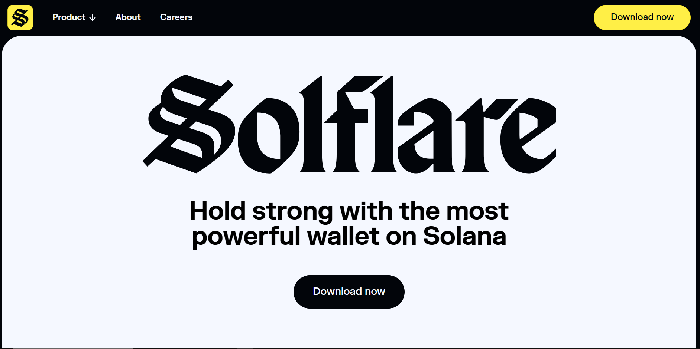

# Benefits of being a Superteam Member

Superteam Membership provides many opportunities, resources, and perks to help members thrive in the Solana ecosystem.&#x20;

### Here’s a detailed breakdown of the benefits:

### **Discounts on Essential Services**

<figure><figcaption></figcaption></figure>

Superteam members enjoy significant discounts on a range of services essential for building and scaling their projects:

* **Up to 100% off legal services**: Access free or heavily discounted legal advice from top-tier law firms. This includes support for drafting contracts, managing compliance, resolving disputes, and handling intellectual property, ensuring you have the legal foundation needed to succeed.
* **40% off security solutions**: Protect your projects with discounted access to advanced services, including security audits, threat monitoring, and dynamic wallet testing. These services help identify vulnerabilities and safeguard your platform against potential risks.
* **33% off tokenomics design and auditing**: Work with experienced Web3 economists, analysts, and researchers to design and audit robust tokenomics models. This ensures your project’s economic framework is effective, scalable, and sustainable.


For a full list of services, check out [this link](https://superteam.fun/member-perks).


### **Exclusive Earning Opportunities**

<figure><figcaption></figcaption></figure>

Superteam Earn gives members access to some of the most lucrative earning opportunities in the crypto space:

* **High-paying bounties**: Take on challenging bounties that match your skills and expertise, with payouts that reflect the quality of your work. These bounties allow you to work with top-tier crypto projects, showcasing your talents while earning substantial rewards.
* **Freelance projects**: Connect with leading crypto companies looking for talented individuals to contribute to their projects. Members can create a profile for free, build their reputation, and start earning immediately by taking on impactful freelance roles.

### **Fundraising Support**

<figure><figcaption></figcaption></figure>

Superteam members benefit from targeted fundraising support designed to help them scale their ventures:

* **Tailored feedback from industry experts**: Gain insights from partners at renowned accelerators and incubators through the Superteam Fast Track program. These experts offer personalized feedback to refine your pitch, optimize your business strategy, and make your venture more attractive to investors.
* **Access to fundraising networks**: Leverage Superteam’s extensive network to connect with potential investors and collaborators. This support can be instrumental in securing the funding needed to take your project to the next level.

### **Investing in Early-Stage Solana Startups**

Superteam Membership offers a unique opportunity to invest in the future of Solana:

* **Deal-by-deal investments**: Members can invest in promising early-stage Solana projects alongside other Superteam Members, Leads, and Solana protocol founders. This structure allows you to carefully select opportunities that align with your interests and goals.
* **Collaborative opportunities**: Work closely with other investors in the Superteam Collective, leveraging their insights and expertise to make informed decisions.

### **Exclusive Member NFT**

As a Superteam Member, you can mint an exclusive Member NFT that unlocks additional perks:

* **Token airdrops and whitelist spots**: Gain access to exclusive token airdrops, whitelist opportunities, and beta program invites. These perks provide early access to some of the most exciting projects in the Web3 space.
* **Membership recognition**: Your NFT serves as proof of your Superteam membership, showcasing your status within the community.

Superteam Membership is your gateway to unparalleled resources, opportunities, and support, empowering you to succeed in the dynamic world of Web3.
