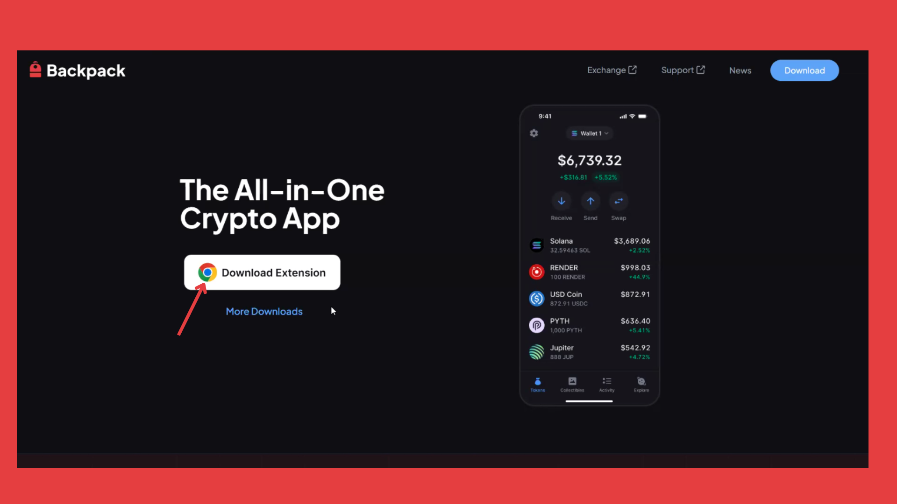
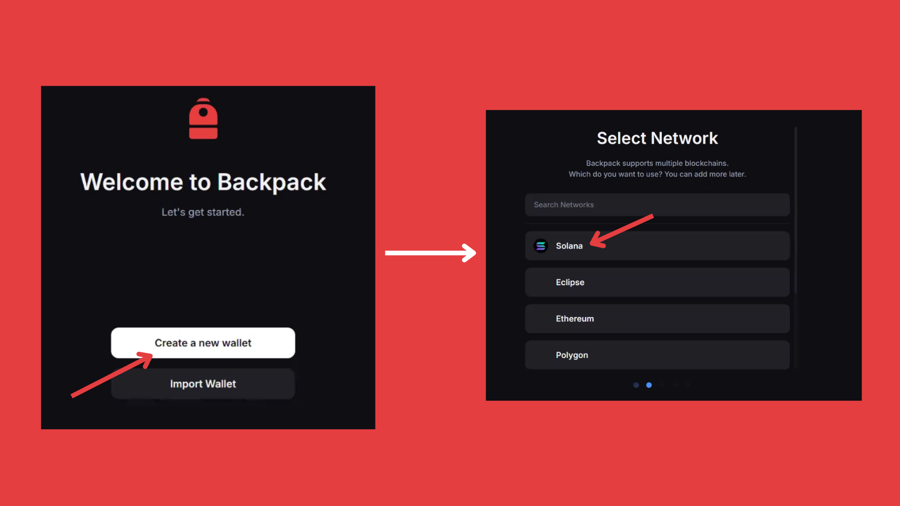

# Backpack Extension

### How To Set Up Backpack Wallet  Extension. 

### Step 1: Download the Backpack Wallet

<figure><figcaption></figcaption></figure>

* Visit [backpack website](https://backpack.app/)
* Click the **Download Extension.**

<figure><figcaption></figcaption></figure>

* Click the Add to **Brave(Browser)** button and wait for the app to install.

### Step 2: Create a New Wallet

<figure><figcaption></figcaption></figure>

* Open the wallet extension and click **Create a New Wallet**.
* Select **Solana Network**

### Step 3: Save Your Recovery Phrase

<figure><figcaption></figcaption></figure>

Carefully write down your recovery phrase and store it in a secure offline location.


**Important:** Never share your recovery phrase with anyone. This is the key to accessing your wallet.


### Step 4: Set Up Security

<figure><figcaption></figcaption></figure>

* Set a strong password,&#x20;
* Agree to the terms of service by clicking the checkbox
* Once completed, click **Next**.

🎉 **Congratulations!** Your Backpack Wallet is now securely set up and ready to use. Explore the world of Solana with ease!

<figure><figcaption></figcaption></figure>

