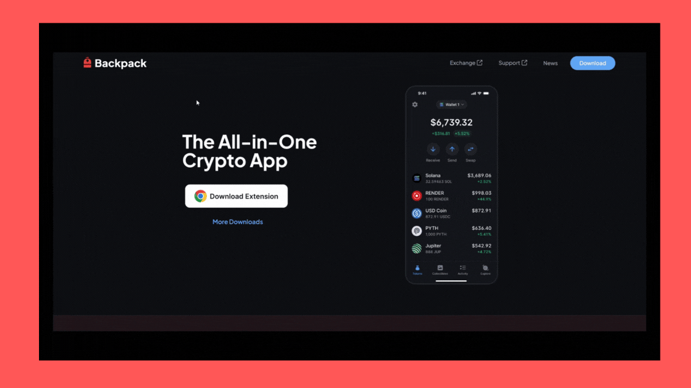

# Backpack Wallet Mobile

### How To Set Up Backpack Wallet Mobile 

Backpack wallets are available as extensions for mobile devices supporting Android and iOS.

### Step 1: Download the Backpack Wallet App

<figure><figcaption></figcaption></figure>

* Head over to the [Backpack download](https://backpack.app/download) page.
* Scroll click **more downloads** button&#x20;
* Click either App Store to download for **iOS** or Google Play to download for **Android.**

### Step 2: Create a New Wallet

<figure><figcaption></figcaption></figure>

* Open the app and select **Wallet**.
* Agree to the terms and click **Continue.**

<figure><figcaption></figcaption></figure>

* Select Solana Network.
* Select **Create a new wallet.**

### Step 3: Save Your Recovery Phrase

<figure><figcaption></figcaption></figure>

* Write down your recovery phrase in a secure, offline location.


**Do not share** your recovery phrase with anyone to keep your wallet safe.


* Once saved, click the **Next Button** to complete the setup process.

<figure><figcaption></figcaption></figure>

🎉 **Congratulations!** Your Backpack Wallet is now set up and ready to use. Enjoy exploring the world of crypto securely!
