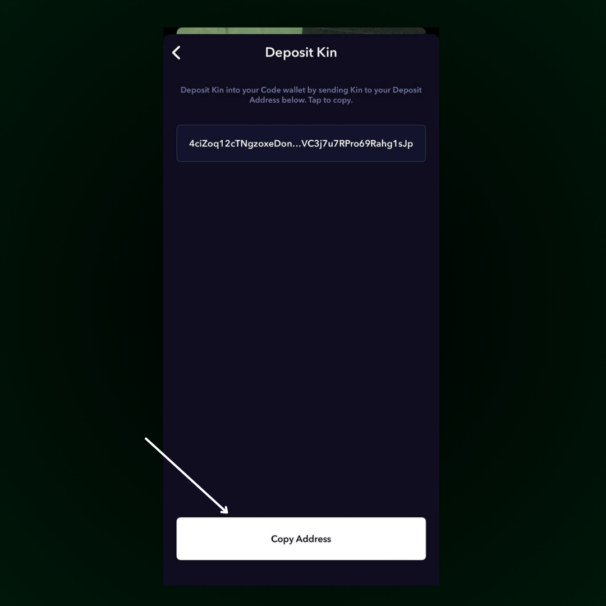

# How to depoit kin

### 1. **Open Your Code Wallet**

In the app, tap the menu icon (the three lines in the top corner) and click **Deposit Kin** from the list.

<figure><figcaption></figcaption></figure>

### 2. **Copy Your Wallet Address**

On the next screen, tap **Copy Address** to copy your unique Code Wallet address. This is the address where you’ll be sending your Kin tokens.

<figure><figcaption></figcaption></figure>

### 3. Send Kin Tokens

Open your Solana wallet (like Solflare). In the wallet, paste the address you copied from your Code Wallet, then send the number of Kin tokens you want to deposit.

<figure><figcaption></figcaption></figure>

### **4. Check Your Deposit**

Once the transaction is processed, you’ll either receive a notification confirming the deposit or you can manually check your balance by visiting the **Balance** section of your Code Wallet.

<figure><figcaption></figcaption></figure>
