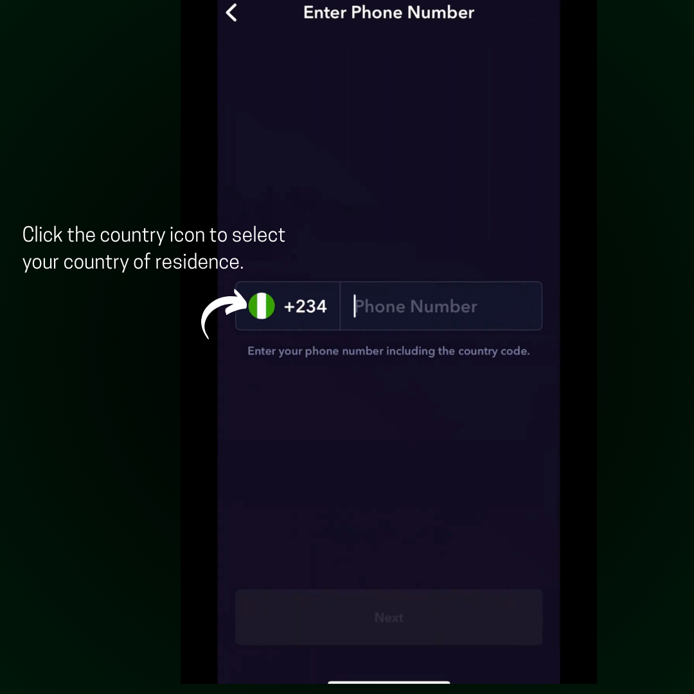
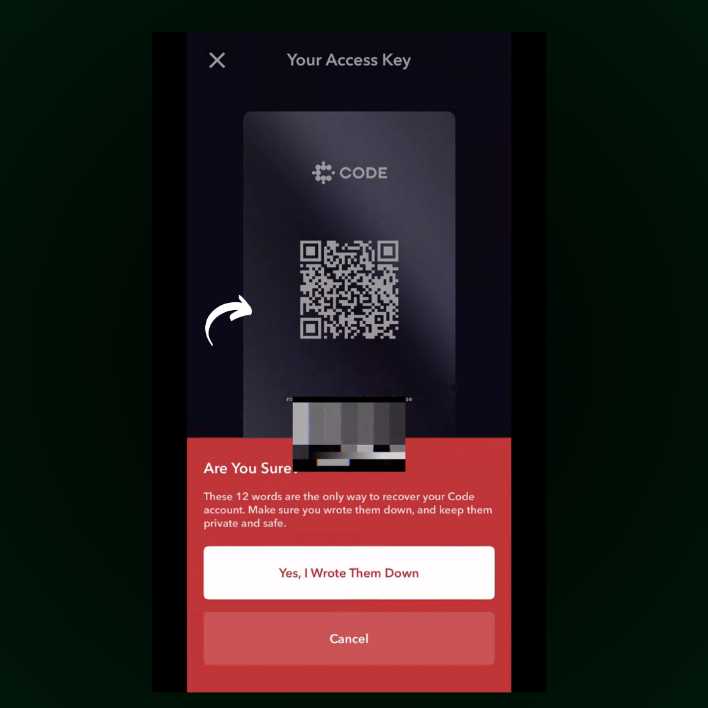
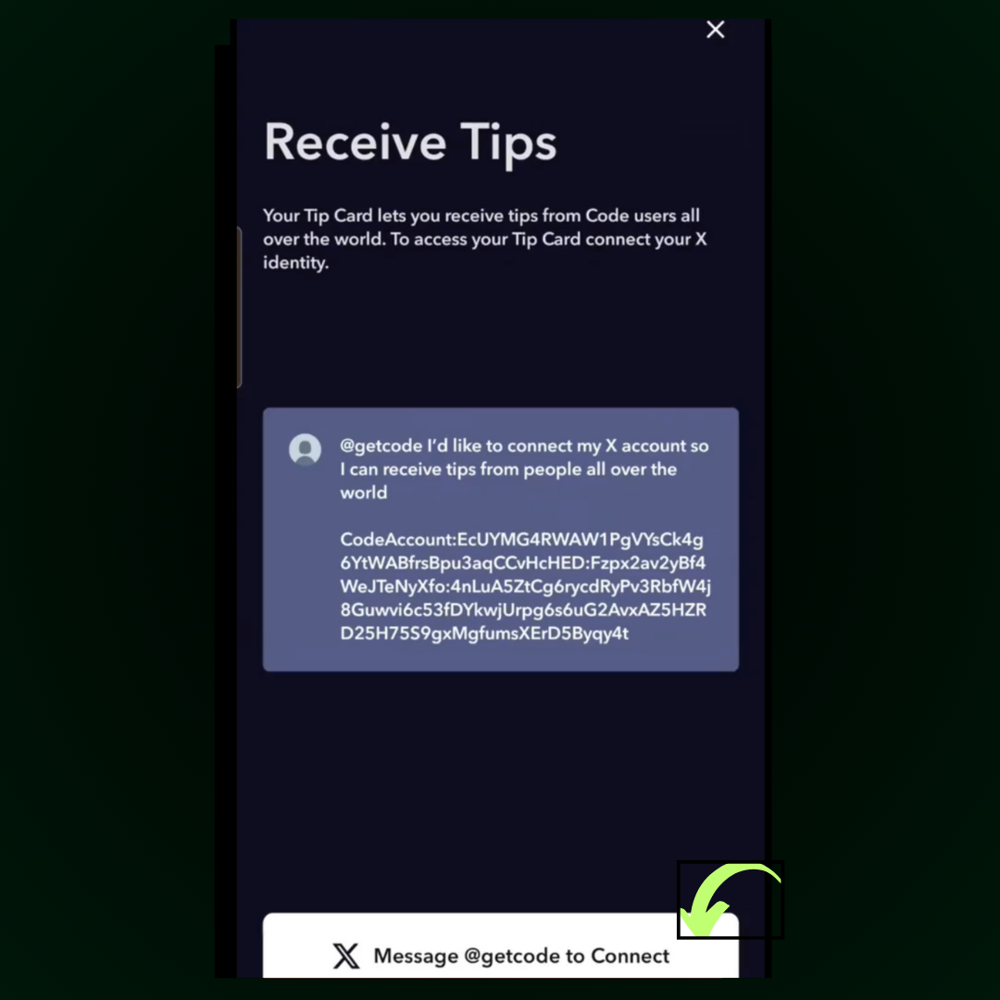

# How to Set Up Your Code Account

### Getting Started with Code Wallet

Setting up your Code Wallet is quick and easy. Just follow these simple steps:

### 1. Download the Code Wallet App

Begin by downloading the Code Wallet app from [here](http://getcode.com/#download-1).

* Download for Apple [here](https://apps.apple.com/us/app/code-wallet/id1562384846)
* Download for Andriod [here](https://play.google.com/store/apps/details?id=com.getcode)

### 2. Create **Your Code Wallet**:&#x20;

Once installed, open the app and tap **Create an Account**.

<figure><figcaption></figcaption></figure>

### 3. Select Your Country and Verify Your Phone

Choose your country of residence and enter your phone number.&#x20;

####

<figure><figcaption></figcaption></figure>

A verification code will be sent to you via SMS. Enter the code to proceed.

<figure><figcaption></figcaption></figure>

### 4. Secure Your Access Key

On the next screen, you'll see your access key. This is crucial for account recovery:

* Save it securely (e.g., save it to your photos or write it down).


**Important**: Keep this key safe and private. It's the only way to access your account.


<figure><figcaption></figcaption></figure>

### 5. Link Your X (Twitter) Account

For added convenience, you’ll need to link your X (formerly Twitter) account. Post a tweet from the account you want to link to your Code Wallet. Your account will be verified once the tweet is sent, allowing you to start receiving tips.

<figure><figcaption></figcaption></figure>

With these easy steps, you’re all set to use your Code Wallet!
