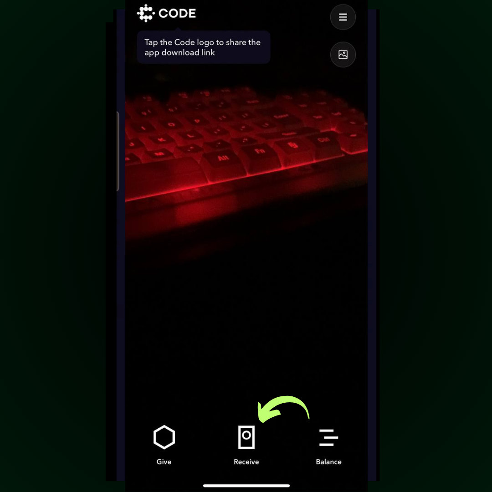

# How to start receiving tips

### 1. **Click the Receive Icon**

Open the Code Wallet app, and tap the **Receive** icon to generate your tip link.

<figure><figcaption></figcaption></figure>

Then click share as a URL.

### **2. Share as a URL**

Select the option to share it as a URL. You can add this link to your X (formerly Twitter) profile or share it with others when they want to tip you.

### 3. Share Your Barcode

Alternatively, you can send a screenshot of your QR code. If someone is nearby, they can simply scan the code to tip you instantly.

<figure><figcaption></figcaption></figure>
