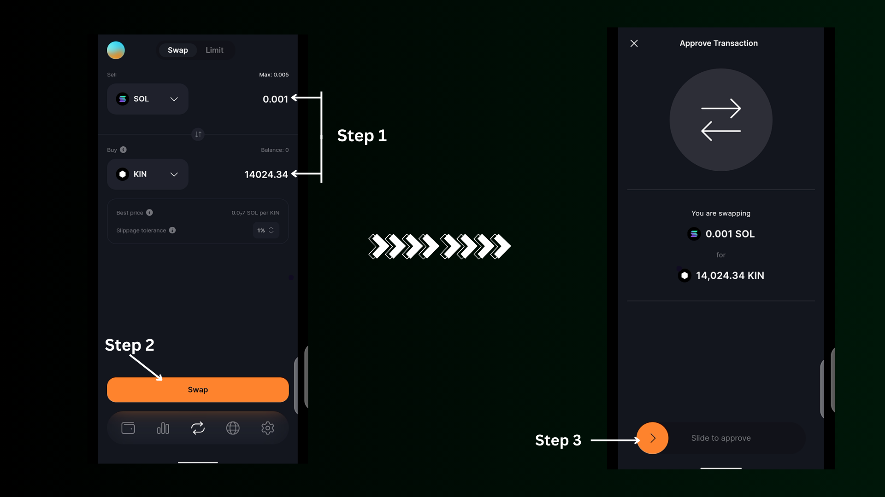
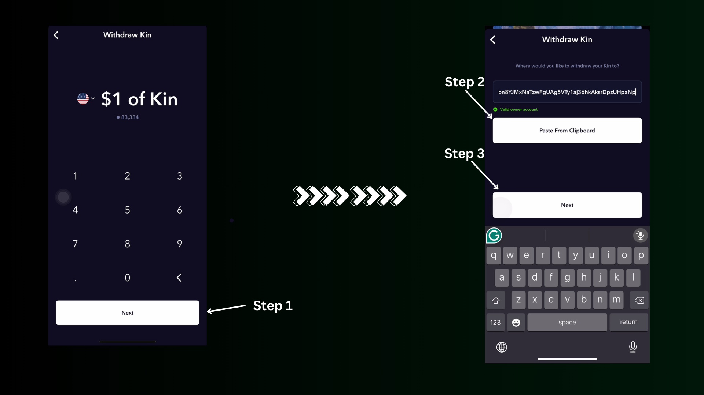

# How to withdraw kin

### **1. Set Up a Solana Wallet:**

Start by setting up a Solana non-custodial wallet. For this guide, we’ll use the **Solflare Wallet**.

1. Download and open the **Solflare Wallet** app.
2. Tap the **Market** section, then click the **Search** icon.
3. Type "KIN" into the search bar, and when the Kin token appears, select it.

<figure><figcaption></figcaption></figure>

### 2. Swap SOL for Kin


Before you can withdraw Kin tokens to an address, that address must hold some Kin tokens (either through receiving or swapping). This step ensures that the address is "verified."


Make sure you have some Solana (SOL) in your wallet. If you don’t, you can buy SOL from a centralized exchange like **Bidget** or **Bybit** and transfer it to your Solflare wallet.

Once you have some **sol** in your wallet, click the swap icon to proceed.

<figure><figcaption></figcaption></figure>

1. Tap the **Swap** button in the Solflare app.
2. On the swap screen, enter the amount of SOL you’d like to exchange for Kin. The equivalent amount of Kin tokens will be displayed.
3. If the price looks good, proceed by tapping **Swap** and slide to approve the transaction.

After the swap, your wallet will show the Kin tokens you acquired.

<figure><figcaption></figcaption></figure>

### 3. Withdraw Kin to Your Code Wallet

In your Solflare Wallet, tap the **Receive** icon and **copy** your wallet address.

<figure><figcaption></figcaption></figure>

Open your **Code Wallet**, tap the hamburger menu ( the three lines in the top corner), and select **Withdraw Kin**.

<figure><figcaption></figcaption></figure>

* Enter the amount of Kin you want to withdraw and tap **Next**.
* Paste the address you copied from Solflare and tap **Next** again.

<figure><figcaption></figcaption></figure>

Before proceeding with the withdrawal, make sure to click the withdraw button and carefully review the destination address. After that, you can check your solflare wallet to confirm that the token has been successfully deposited.&#x20;

<figure><figcaption></figcaption></figure>
