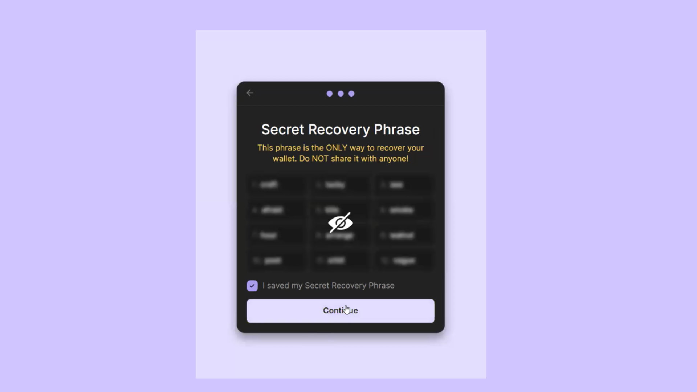

# Phantom Extension (Seed Phrase)

### How To Set Up Phantom Wallet for Desktop 

Phantom Wallet is a popular Solana wallet available as a browser extension for Chrome, Firefox, Brave, and Edge. Follow these steps to set up your wallet:

### **Step 1: Download the Phantom Extension**

<figure><figcaption></figcaption></figure>

* Visit the Phantom [download page](https://phantom.app/download).
* Scroll down and click your browser's icon (e.g., click the Brave icon if you're using Brave).
* On the extension page, click the **Add to \[Browser Name]** button to install the Phantom Wallet.

### Step 2: Set Up Your Wallet

<figure><figcaption></figcaption></figure>

* Once installed, click **Create a New Wallet**.
* Select the option to create a wallet with a seed phrase.
* Set a strong password, agree to the terms of service, and click **Continue**.

### Step 3: Save Your Recovery Phrase

<figure><figcaption></figcaption></figure>

* Carefully write down your recovery phrase and store it in a secure offline location.


**Important:** Never share your recovery phrase with anyone. This is the key to accessing your wallet.


* After saving it, click **Continue** to proceed.

<figure><figcaption></figcaption></figure>

Congratulations, You’ve successfully set up your Phantom Wallet. You're now ready to explore the Solana ecosystem!
