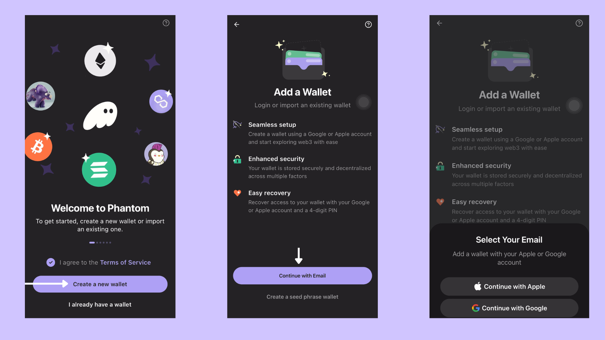

# Phantom Mobile (Email Sign Up)

### How To Set Up Phantom Mobile Wallet  

Phantom Wallet is a secure and user-friendly option for managing your crypto assets. It's available for both Android and iOS devices.&#x20;

Here's how to set it up:

### Step 1: Download the Phantom App

<figure><figcaption></figcaption></figure>

* Visit [phantom.app/download](https://phantom.app/download).
* Scroll down to the mobile section and click either **iOS** or **Android**, according to the OS of your mobile device.
* Tap the **Download** button and wait for the app to install.

### Step 2: Create a New Wallet

<figure><figcaption></figcaption></figure>

* Open the app and click **Create a New Wallet**.
* Select **Continue with Email**.
* Choose your preferred sign-up method, either **Apple** or **Google**.

### Step 3: Set Up Security

<figure><figcaption></figcaption></figure>

* Create a **four-digit PIN** and tap **Continue**.


Losing your PIN means losing access to your account. Phantom does not store your PIN, so it's crucial to use a password you can easily remember.


* Enable additional security features such as **Face ID** or **fingerprint authentication** for added protection.
* Once completed, click **Next**.

<figure><figcaption></figcaption></figure>

🎉 **Congratulations!** Your Phantom Wallet is now securely set up and ready to use. Explore the world of Solana with confidence!
