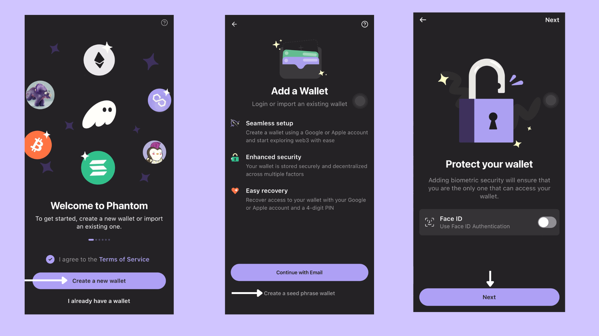

# Phantom Mobile (Seed Phrase)

### How To Set Up Phantom Wallet Mobile 

Phantom wallets are available as extensions for mobile devices supporting Android and iOS.

### Step 1: Download the Phantom App

<figure><figcaption></figcaption></figure>

* Head over to the [Phantom download](https://phantom.app/download) page.
* Scroll down to the mobile section and click either **iOS** or **Android**, according to the OS of your mobile device.
* Click the **Download** button and wait for the app to install.

### Step 2: Create a New Wallet

<figure><figcaption></figcaption></figure>

* Open the app and select **Create a New Wallet**.
* Choose the option to create a "**Seed Phrase Wallet."**
* Enable security features such as "**Face ID"** or "**Fingerprint Authentication"** for added protection.

### Step 3: Save Your Recovery Phrase

<figure><figcaption></figcaption></figure>

* Write down your recovery phrase in a secure, offline location.


**Do not share** your recovery phrase with anyone to keep your wallet safe.


* Once saved, click **Continue** to complete the setup process.

🎉 **Congratulations!** Your Phantom Wallet is now set up and ready to use. Enjoy exploring the world of crypto securely!
