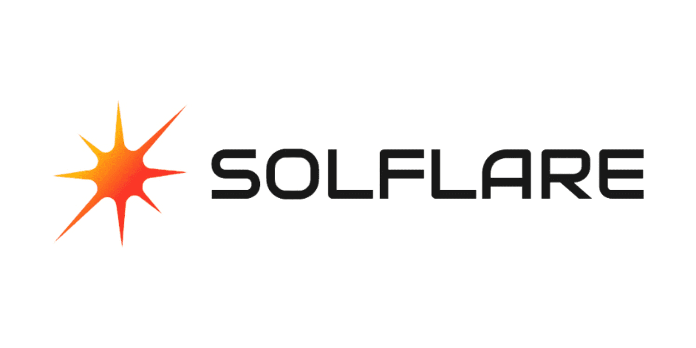

# Solflare

<figure><figcaption></figcaption></figure>

This guide walks you through the essential steps to set up your Solflare **wallet. H**elping you create your wallet and secure your private keys.

Whether you are new to crypto or looking to expand your knowledge, this documentation offers all the essential tools and insights needed to maximize your experience with the Solflare Wallet.
