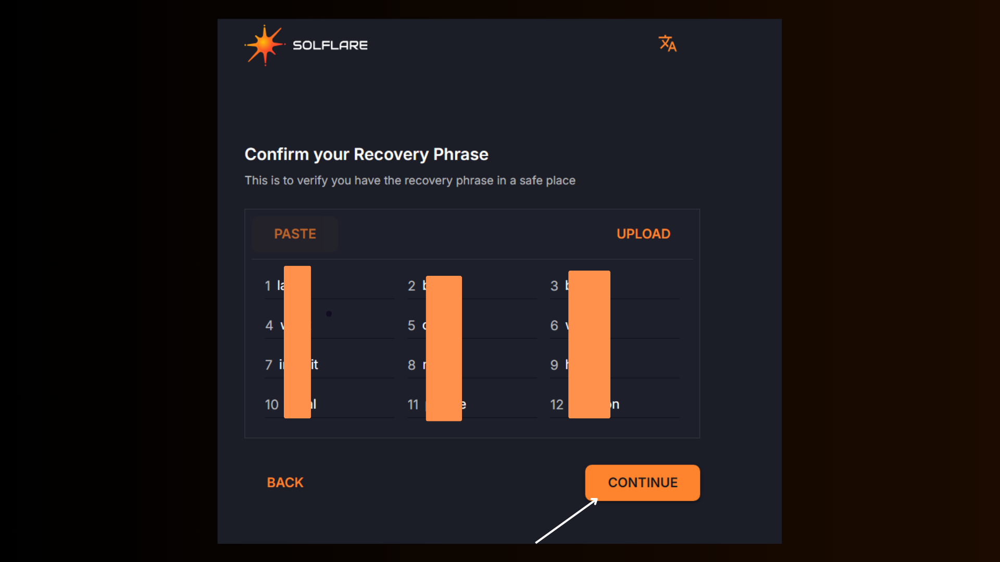
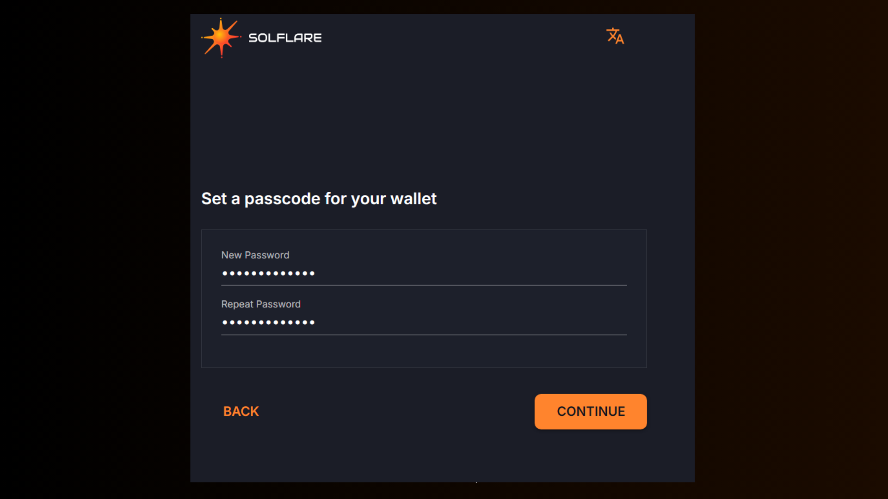

# How to set up solflare wallet web extension

## Step 1: Download the Solflare Wallet 

To get started, visit the official [**Solflare website**](https://solflare.com/)to download the wallet. **Click Add to Brave** (this option will vary depending on your browser, such as Chrome, Brave, or Edge), then click the **Add Extension** button

<figure><figcaption></figcaption></figure>

## Step 2: Create a New Wallet 

After installing the app, open it and click the **“I NEED A NEW WALLET”** button. This will guide you through the initial setup process, which is straightforward and helps you create a secure digital wallet.

<figure><figcaption></figcaption></figure>

## Step 3: Securely Store Your Recovery Phrase 

During setup, you’ll receive a recovery phrase _**(a set of words that is your key to accessing your wallet)**_.

> **It’s extremely important to write this phrase down on paper and store it securely in a safe, offline location. Do not save it digitally or share it with anyone.**

Your **recovery phrase** is your ultimate access key, and losing it can lead to permanent loss of your funds. Similarly, anyone who obtains it can access your wallet and funds.

<figure><figcaption></figcaption></figure>

## Step 4: Confirm Your Recovery Phrase 

To ensure you’ve correctly saved your recovery phrase, Solflare will guide you through a quick verification.

You’ll be asked to confirm words from your recovery phrase.

Follow the instructions, fill in the correct word(s), and click **“Continue.”**

This step ensures that you’ve securely backed up your access key.

<figure><figcaption></figcaption></figure>

## Step 5: Set Up a Security Code 

Create a security code as an additional layer of protection for your assets.

<figure><figcaption></figcaption></figure>

Congratulations! Your Solflare wallet setup is now complete, and you’re ready to manage your Solana assets securely.

<figure><figcaption></figcaption></figure>

Bonus.

To ensure your Solflare extension is easily accessible on your browser interface, click the extension icon in your browser's toolbar. Then, find the Solflare extension from the list and click the pin icon next to it.&#x20;

This will "pin" the Solflare extension, making it visible on the toolbar for quick access whenever you need it.

<figure><figcaption></figcaption></figure>
