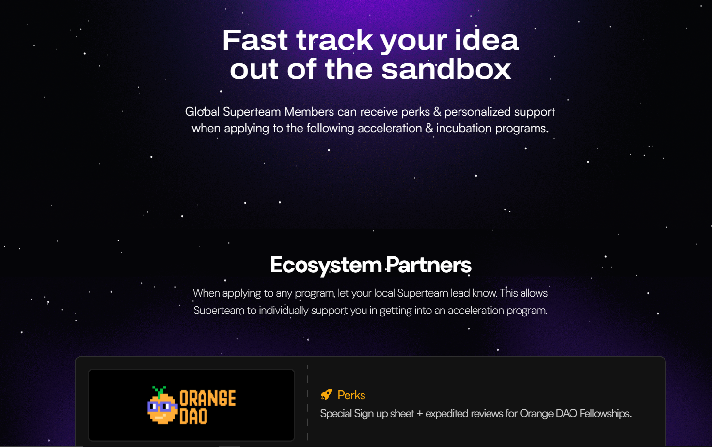

# Introdution to solflare

**What Exactly is Solflare Wallet?**

[Solflare](https://solflare.com/) is a non-custodial cryptocurrency wallet that lets you store, send, & receive tokens on the [Solana](https://solana.com/) blockchain. It’s available on the web, as a browser extension, and as a mobile app for Android and iOS.&#x20;

Solflare is the perfect wallet to help you safely explore Solana, buy and store tokens, swap assets, manage NFTs, and dive into decentralized finance (DeFi) from your mobile device or computer.[\
](https://chrome.google.com/webstore/detail/solflare-wallet/bhhhlbepdkbapadjdnnojkbgioiodbic)

<figure><figcaption></figcaption></figure>

**Core Features:**

**Security:**

First and foremost, Solflare ensures your assets are safe with a range of security features:

* **Non-custodial:** You control your private keys, giving you full ownership and security of your assets.
* **Hardware Wallet Support:** For extra peace of mind, Solflare works with ledger devices such as [@Ledger](https://x.com/Ledger) and [@KeystoneWallet](https://x.com/KeystoneWallet) to provide added protection.
* **Transaction Simulations:** Before you sign any transaction, Solflare lets you preview it to help avoid costly mistakes.
* **Anti-Phishing:** Solflare protects you from potentially harmful websites by alerting you to phishing risks.

**Easy of Use:**

In addition to top-notch security, Solflare is designed with ease of use in mind.

* **Clean Interface:** Whether you're a beginner or an expert crypto user, Solflare's simple, user-friendly interface makes navigation very easy.
* **Easy Token Management:** You can easily buy, store, send, and swap tokens—all within the wallet, without needing third-party apps.
* **NFT Support:** Solflare allows you to manage, view, and trade your NFTs effortlessly, keeping everything in one place.
* **Staking:** Want to earn rewards? Solflare makes staking your SOL tokens quick and simple.
* **dApp Integration:** Connect to a wide range of Solana dApps to explore the growing Solana ecosystem.
* **Push Notifications:** Stay up to date with important account activity and announcements with real-time notifications.
* **Activity History:** Easily track your transaction history so you can always control your finances.

**Additional Features:**

* **Mobile and Desktop Access:** For maximum convenience, you can access Solflare on both mobile and desktop, whether you're on the go or working at your desk.

