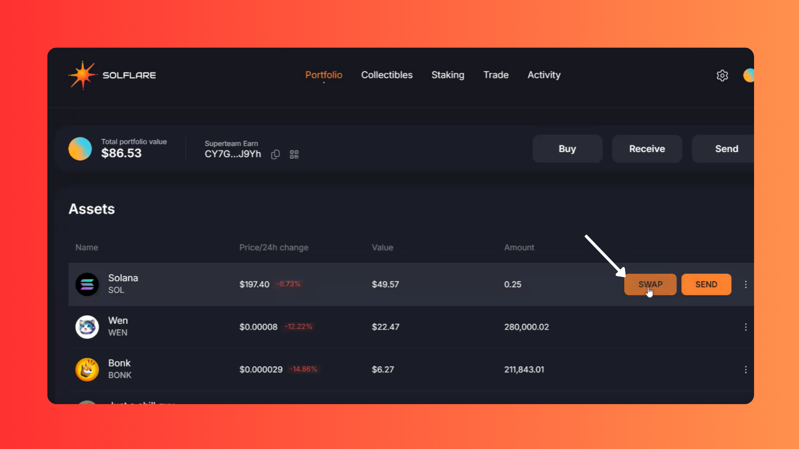
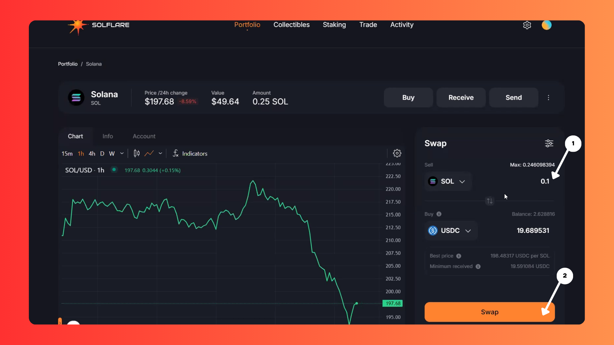

# How to swap on Solflare Extension



### **Step 1: Open the Solflare Wallet Extension**

To begin, locate the Solflare Wallet icon in the top-right corner of your browser (in the extensions tab). Click on it to open the wallet.


If you don’t see the Solflare Wallet icon, ensure the extension is installed and pinned to your browser.


<figure><figcaption></figcaption></figure>

### Step 2: Open Solflare in a New Tab

Once the wallet extension opens, you’ll notice a small **square icon** in the interface. Click this icon to open Solflare in a new browser tab for a better view.

<figure><figcaption></figcaption></figure>

### **Step 3: Choose the Token You Want to Swap**

Now that you’re in the Solflare dashboard, hover your cursor over the token you want to swap.&#x20;

You’ll see a **Swap** button appear

Click on it to proceed.

<figure><figcaption></figcaption></figure>

### Step 4: Enter the Swap Details

For this guide, we’ll swap **SOL** for **USDC** as an example. Here’s what to do:

1. Enter the amount of SOL you’d like to swap.
2. The Solflare wallet will automatically calculate the equivalent amount of USDC based on the current rate.
3. Double-check the details and ensure you’re satisfied with the values.
4. Click the **Swap** button to continue.

<figure><figcaption></figcaption></figure>

### **Step 5: Confirm the Transaction**

A confirmation window will appear showing the transaction details. Take a moment to review the token amount details:

If everything looks good, click the **Confirm** button to finalize the swap.

<figure><figcaption></figcaption></figure>

### Final Steps: Check Your Swapped Tokens

Once the transaction is successful, you'll receive a notification.

* Click the **Portfolio** link to view your swapped tokens.

<figure><figcaption></figcaption></figure>

* Alternatively, you can open the Solflare Wallet extension to check your updated balances.

<figure><figcaption></figcaption></figure>

Congratulations, you’ve successfully swapped tokens using the Solflare Wallet! You can follow these steps to swap any supported token pair in the future.
